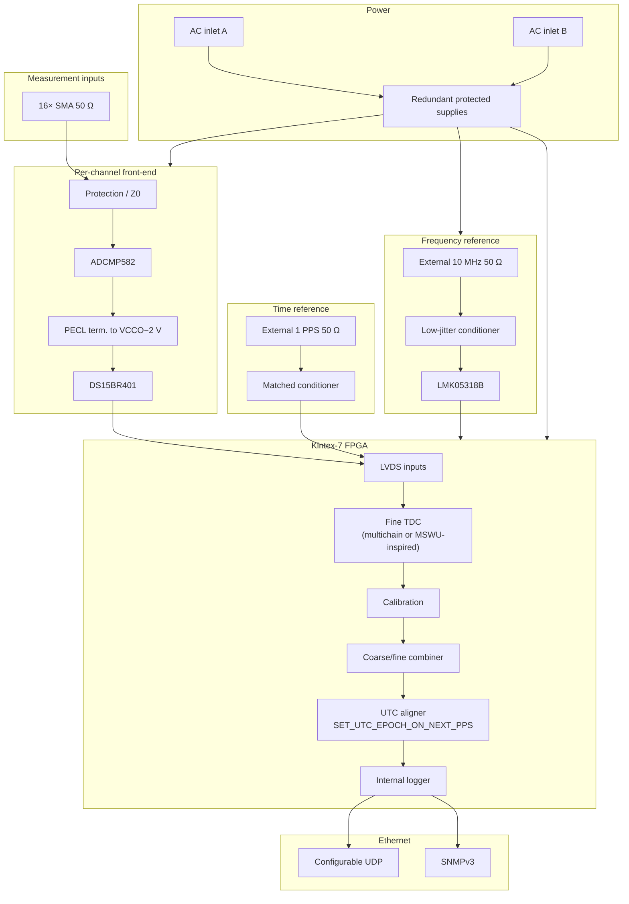

# Architecture (hypothesis → POC baseline candidates)

This document describes the **POC-level baseline candidates** for electrical,
reference-clock, and UTC alignment subsystems. The **fine TDC** branch is still
**not** selected from Vivado alone
([analysis/architecture-trade-study.md](analysis/architecture-trade-study.md)).

Maturity: **TRL 2**. No physical validation. Target after funded POC: **TRL 5/6**.

## Context

- Challenge: 16-channel Time Interval Data Logger (TIDL).
- Radio: **none**. No Wi-Fi. No Bluetooth. Ethernet only.

## System block diagram

## Electrical / clock / UTC baselines (candidates)

| Subsystem | POC candidate | Doc |
| --- | --- | --- |
| Measurement front-end | ADCMP582 → PECL term. → DS15BR401 → Kintex-7 LVDS | [frontend-electrical-baseline.md](analysis/frontend-electrical-baseline.md) |
| Direct PECL→LVDS_25 @ VCCO=2.5 V | Optional optimization; **not** baseline | same |
| 10 MHz clocking | LMK05318B; external 10 MHz authority; ~250 MHz FPGA clock plan TBD | [reference-clock-architecture.md](analysis/reference-clock-architecture.md) |
| UTC epoch | `SET_UTC_EPOCH_ON_NEXT_PPS`; NTP/PTP label-only | [utc-timestamp-architecture.md](analysis/utc-timestamp-architecture.md) |

## Fine-TDC candidates (no Vivado-only winner)

| ID | Candidate | Local structural note |
| --- | --- | --- |
| A | Parallel multi-chain FPGA TDL | Round 7 16ch: 13669 slices (53.92%), WNS +3.045 ns |
| B | MSWU-inspired structural surrogate | Round 9 16ch: 2935 slices (11.58%), WNS +0.162 ns; WU pulse not validated |
| C | Hybrid | Highest 12-month implementation risk |
| Aux | DDMTD | Periodic characterisation only |

## Frozen local FPGA evidence (structural only)

See [vivado-baseline-decision.md](analysis/vivado-baseline-decision.md) and
`docs/evidence/vivado_kintex7_*`.

## Data path

Every record carries UTC/coarse context, channel, fine time, sequence, quality
bits, calibration version, and an integrity field. UDP is the export path;
the internal log is the measurement of record (S10, S13).
